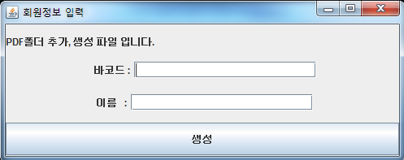
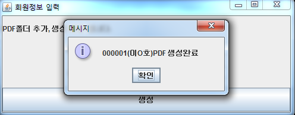
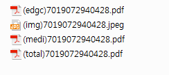
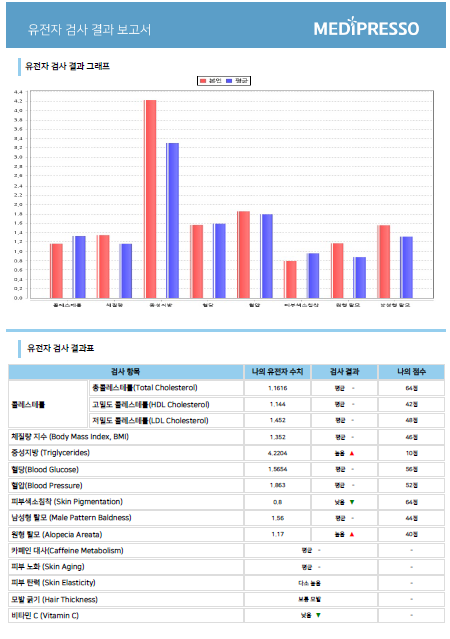
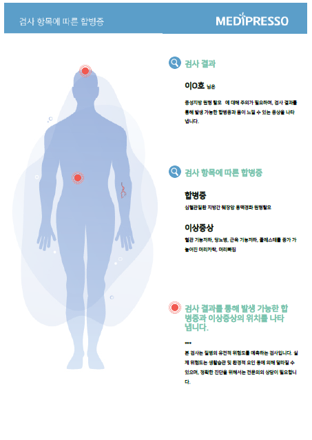
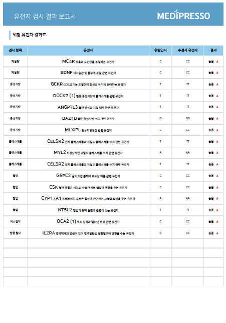
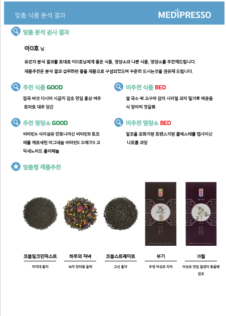

</img> 

# 자바로 만든 개인 맞춤 PDF 생성 EXE 실행파일

실행파일을 통해 유전자 키트 바코드번호와 이름을 입력 시 해당하는 사람의 유전자 기반 개인 맞춤 식품 & 제품 추천 pdf가 지정된 폴더에 생성

***

# 개발환경 

* html

* css

* java

* mysql

* 라이브러리 : itextpdf, jcommon, jfreechart, pdfbox, xmlworker, mysql

***

# 기능 소개

1. 실행파일 키값 입력란 및 완료   

 

2. 생성된 PDF 파일

 

***

# 코드 소개 

* jfreechart.java   

평균 DNA수치와 본인 DNA수치를 라이브러리 이용해서 그래프로 생성(JPG)

* pdf_table.java   

pdf파일을 생성하기 위해 html을 작성하고 변환하는 부분

* category_gene.java   

질병 중 '높음'에 해당하는 항목을 추출하여 변수에 저장 

* category.java   

DB가공 및 추천 식품&제품 알고리즘 부분

* mixpage.java   

pdf파일 저장할 위치 지정 및 폴더 생성, 파일생성, 2개의 pdf파일 병합

* gui.java   

java에서 제공하는 gui (키값 입력란)
